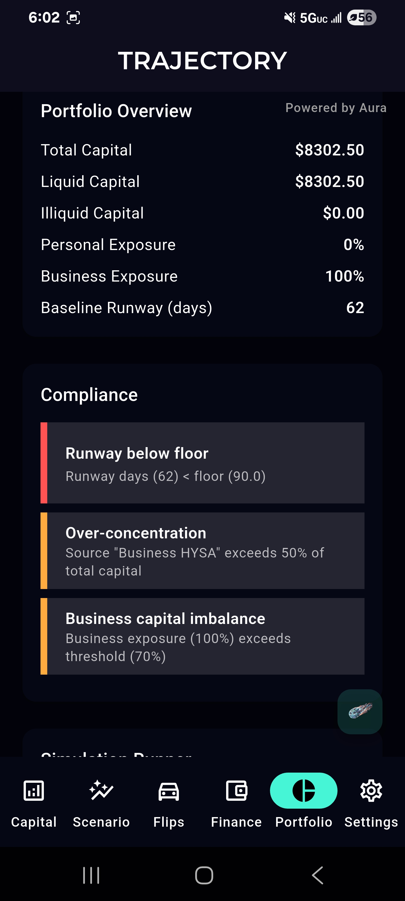
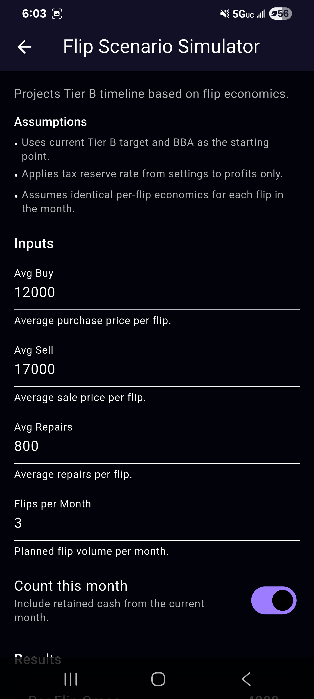
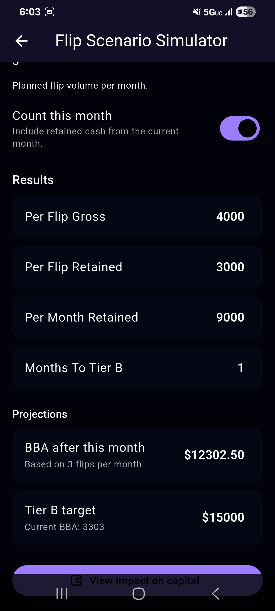

# Trajectory

Mobile-first Flutter/Dart system for deterministic capital modeling, scenario simulation, and compliance enforcement.

Trajectory is a curated public surface of a proprietary mobile system. It highlights deterministic system design, product execution quality, and architecture-first thinking without exposing sensitive implementation details.

This MVP is fully built and running on-device, demonstrating real-world execution of the system.

## MVP Screenshots

- Portfolio + compliance engine

- Scenario simulation

- Projection + tiering logic

## Architecture Overview

- Single source of truth state model
- All outputs derived from explicit financial flows
- No probabilistic or AI-based calculations in core logic
- Offline-first design with local persistence

Core flow:
Inputs → Deterministic Engine → Compliance Layer → Projections → UI

## Repository Structure

This repository presents a curated public surface of the system:

- assets/ — screenshots and diagrams used for portfolio presentation
- docs/ — high-level architecture, principles, and scope boundaries
- public_examples/ — abstract placeholder-style state examples

Platform-specific build targets and internal tooling have been excluded for clarity.

This repository presents a curated public surface. Core implementation details are intentionally omitted.
